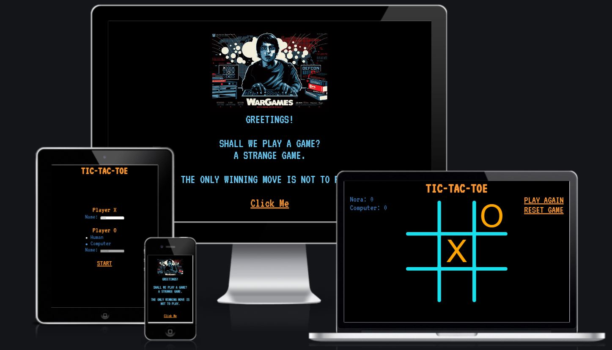
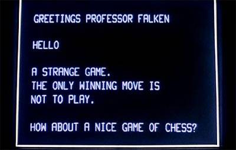
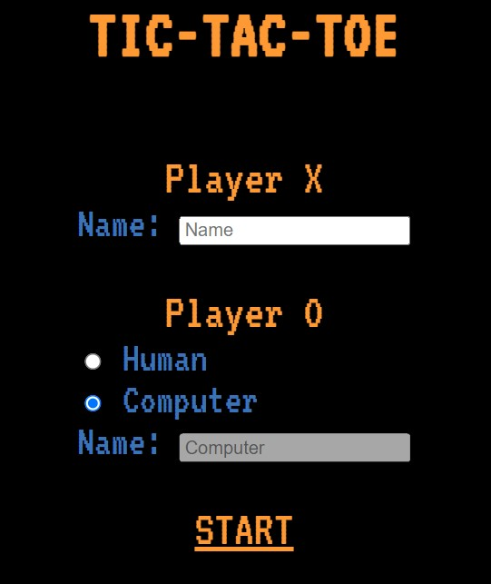
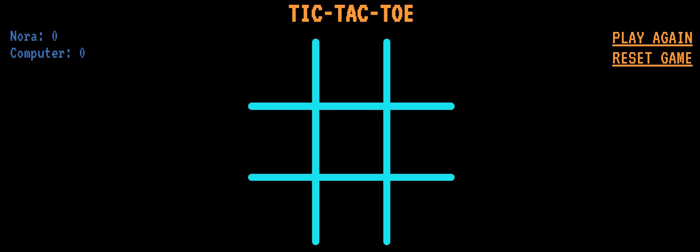

# **WarGames Tic-Tac-Toe**

WarGames Tic-Tac-Toe is a tic-tac-toe game inspired by the '80s film, WarGames (1983), so I have used design elements that are similar to the film's design elements, such as font colour, font type, pictures, gifs. I have taken the main quote out of the film for the welcome screen, to make it more theatrical for the players. 
The goal is to have three X's or O's horizontally, vertically or diagonally, so we can have a winner.

You can view the live site here - <a href="https://norapdev.github.io/tictactoe/" target="_blank" rel="noopener">WarGames Tic-Tac-Toe</a>

## Table of contents
1. [**Planning Stage**](#planning-stage)
1. [**Features**](#features-on-the-welcome-screen)
1. [**Features on the Game Page**](#features-on-the-board-page)
1. [**Future Features to be Added**](#future-features-to-be-added)
1. [**Testing**](#testing)
1. [**Deployment**](#deployment)
1. [**Bugs**](#bugs)
1. [**Technology Used**](#technology-used)
1. [**Credits**](#credits)

## **Planning Stage**
Most of the Tic-Tac-Toe games I have seen online require two players, where players can be either human or computer. The game board normally is a board with 3 x 3 squares. As I mentioned above, the main goal is to achieve three same symbols in a row - horizontally, vertically or diagonally on a 3 x 3 grid. This player will be the winner. 

In this game, I wanted to make it less boring, more challanging by creating an AI to play against, therefore we have two options, either play against a human or play against the computer. 

Player Stories
As a player, I want to see a pure and clean site with a design that is comfortable and fun to look at.
As a player, I want to be able to navigate on the game site easily, without any distractions.
As a player, I want to be able to have a true game feeling with AI experience.
As a player, I want to be able to have the experience of playing with a fellow player, not just a computer.
As a player, I want to be able to see my scores and wins all the time.

## **Features**

When you open the site, the main picture and the main quote comes up initially, to create the '80s vibe and the theme for the film. There is a nice typewriter effect created in JS to enhance the retro style.
To learn more about the film, visit here -> <a href="https://www.imdb.com/title/tt0086567/plotsummary" target="_blank" rel="noopener">IMDB WarGames Plot Summary</a>

From the welcome screen you can click to enter the player field, which is where you can add your names and decide if you would like to play against a human being or the computer. The standard opponent is the computer, so I have disabled and prefilled the name of the Computer. If the player wants to change to Human, the input field would be activated and a name can be typed in. I have made adding a name and chosing an opponent mandatory (JS function), you can only play if you are serious about playing! :sunglasses: :computer: 

When the player press START the game begins and the game area will appear along with the scores field. The scores table will have the typed in names in there with the relevant most recent scores.

First player is always X. When the board has three X's or O's horizontally, vertically or diagonally, an alert pops up advising that there is a winner (or Draw) and which player the winner is. Alternatively, if we chose to play against the Computer, you can have a You Lose sign as well.

## **Credits**

http://dugandzic.us/images/easyblog_images/64/b2ap3_thumbnail_wargames.jpg
https://makeagif.com/gif/wargames-1011-movie-clip-tic-tac-toe-with-joshua-1983-hd-N2q-9R
https://creative-analytics.corsairs.network/wargames-80s-style-deep-learning-3bf406f61582
https://www.imdb.com/title/tt0086567/plotsummary
