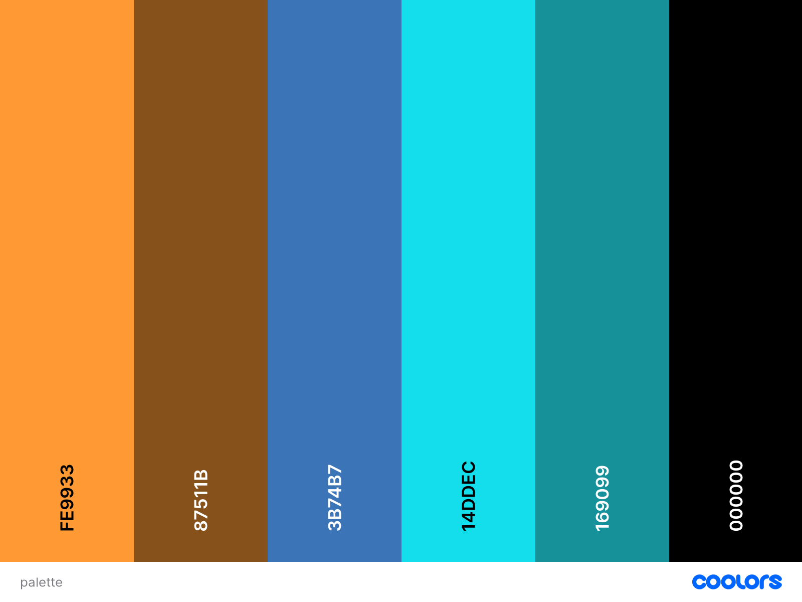

# **WarGames Tic-Tac-Toe**

WarGames Tic-Tac-Toe is a tic-tac-toe game inspired by the '80s film, WarGames (1983), so I have used design elements that are similar to the film's design elements, such as font colour, font type, pictures, gifs. I have taken the main quote out of the film for the welcome screen, to make it more theatrical for the players. 
The goal is to have three X's or O's horizontally, vertically or diagonally, so we can have a winner.

You can view the live site here - <a href="https://norapdev.github.io/tictactoe/" target="_blank" rel="noopener">WarGames Tic-Tac-Toe</a>

## Table of contents
1. [**Planning Stage**](#planning-stage)
1. [**Features**](#features)
1. [**Features on the Game Page**](#features-on-the-game-page)
1. [**Future Features to be Added**](#future-features-to-be-added)
1. [**Testing**](#testing)
1. [**Deployment**](#deployment)
1. [**Bugs**](#bugs)
1. [**Technology Used**](#technology-used)
1. [**Credits**](#credits)

## **Planning Stage**
Most of the Tic-Tac-Toe games I have seen online require two players, where players can be either human or computer. The game board normally is a board with 3 x 3 squares. As I mentioned above, the main goal is to achieve three same symbols in a row - horizontally, vertically or diagonally on a 3 x 3 grid. This player will be the winner. 

In this game, I wanted to make it less boring, more challanging by creating an AI to play against, therefore we have two options, either play against a human or play against the computer. 

Player Stories
As a player, I want to see a pure and clean site with a design that is comfortable and fun to look at.
As a player, I want to be able to navigate on the game site easily, without any distractions.
As a player, I want to be able to have a true game feeling with AI experience.
As a player, I want to be able to have the experience of playing with a fellow player, not just a computer.
As a player, I want to be able to see my scores and wins all the time.

### **Wireframe**
The initial idea of the website was created in Balsamiq, to help me guide through the building stage as the different features have been added. 
As the website became more and more visually attractive, it was clear that some features need to be hidden or disabled, therefore I had to make some additional implementations, for it to be user friendly and better from a player's perspective. The pictures below show my initial thoughts of the site, but it has been altered since.

Links
* [Welcome Screen](assets/images/balsamiq-start.png)
* [Game Area](assets/images/balsamiq1.png)

### **Colour Scheme and Font Choice**
I chose the colours to be true to the film and to the era of 1983.
At first, I felt a bit to basic with my colour choice, however this is about retro feeling, hence the basic dark and neonish colour choices as well.
I wanted the website to be easily readable and color blind friendly as well.

 * Colour scheme used
 

 I have chosen VT323 font from Google Fonts to give the '80s retro feel. I had to increase the font size a little to make it a clean and readable font. I have used a typewriter effect which I created with JavaScript. I believe this effect gives a really unique and fun outlook to the very start of the game.

## **Features**

When you open the site, the main picture and the main quote comes up initially, to create the '80s vibe and the theme for the film. There is a nice typewriter effect created in JS to enhance the retro style.
To learn more about the film, visit here -> <a href="https://www.imdb.com/title/tt0086567/plotsummary" target="_blank" rel="noopener">IMDB WarGames Plot Summary</a>

## **Features on the Game Page**
From the welcome screen you can click to enter the player field, which is where you can add your names and decide if you would like to play against a human being or the computer. The standard opponent is the computer, so I have disabled and prefilled the name of the Computer. If the player wants to change to Human, the input field would be activated and a name can be typed in. I have made adding a name and chosing an opponent mandatory (JS function), you can only play if you are serious about playing! :sunglasses: :computer: 

When the player press START the game begins and the game area will appear along with the scores field. The scores table will have the typed in names in there with the relevant most recent scores.

First player is always X. When the board has three X's or O's horizontally, vertically or diagonally, an alert pops up advising that there is a winner (or Draw) and which player the winner is. Alternatively, if we chose to play against the Computer, you can have a You Lose sign as well.

* [Draw](assets/images/draw.jpg)
* [You won!](assets/images/won.jpg)
* [You lose!](assets/images/comp-won.jpg)

## **Future Features to be Added**

The game and site still needs some improvements and additional features:
* A login page, with an additional database to store the previously achieved scores, so players can keep a record
* Video chat function

## **Testing**

### **Code Validation**

* I have tested the website on a number of browsers and devices both manually and using the tools below.
The codes are all validated by [W3C HTML Validator](https://validator.w3.org/) and [W3C CSS Validator](https://jigsaw.w3.org/css-validator/). A minor warning and errors were found on the index.html when tested, but I have managed to fix them immeditately.  

I have also tested it on [JSHint](https://https://jshint.com/) and got below results. Please see explanation below as well.

* The 2 undefined variables have been copied from [Sweetalert](https://sweetalert2.github.io/#download) therefore this is not my code, so I have not declared the variable.

* The 7 unused variables are actually all used in index.html as an onclick event. 

So apart from these comments the website has passed this test as well.

### **Lighthouse Testing**

### **Site Contrast Testing**

#### **WCAG Report**

* I have tested the site with [WCAG](https://chrome.google.com/webstore/detail/wcag-color-contrast-check/plnahcmalebffmaghcpcmpaciebdhgdf?hl=en) for any color blindness issues or contrast issues. The test is showing one contrast issue for deuteranopia for one of the blue shades.

## **Deployment**
I have followed the steps below for deployment:

1. Find the correct repository on GitHub
1. On the repository site, click on **Settings**
1. There is a menu on the left, click on **Pages**
1. Under the source section, change the **Branch** type to **main** and then click **Save**
1. The section above will indicate that the site is ready to be published and then it will change to **published**.

## **Bugs**
I have found a couple of errors during developing the site, for example:

1.
* Problem :lady_beetle: : Typewriter effect from an external source didn't want to work in CSS.
* Resolution :white_check_mark: : I have created a typewriter effect in JavaScript instead.

2.
* Problem :lady_beetle: : Pop up window pushed everything up on screen, when appeared.
* Resolution :white_check_mark: : I had to add heightAuto: false into the popup function.

3.
* Problem :lady_beetle: : Welcome screen typewriter effect text pushed the **Click Me** button down, while doing the effect.
* Resolution :white_check_mark: : I had to put the button in a separate div.

4.
* Problem :lady_beetle: : When played against the Computer and human lost, still got the same **Congratulations!** popup
* Resolution :white_check_mark: : I had to change the popup to be different when the player loses against the Computer or a human being.

## **Technology Used**

I have used HTML5, CSS3 and JavaScript to build this website. 

**HTML5**
Used to add content and structure to the website

**CSS3** 
Used to add style to the content

**JavaScript**
Used to add functions and player experience to the game

## **Credits**

### **Content**
* The text and style on the welcome screen and the game area have been inspired by the film, WarGames. 

    * [IMDB WarGames Plot Summary](https://www.imdb.com/title/tt0086567/plotsummary)
    * [Initial quote](http://dugandzic.us/images/easyblog_images/64/b2ap3_thumbnail_wargames.jpg)

* The inspirations behind the Readme template:

    *https://github.com/NoraPDev/ApplePieJoinery/blob/main/README.md

* As this is my first project in JavaScript, it was influenced by the study material as well, namely the Love Math project from Code Institute material.
* I have also used Google, W3 school, YouTube to get more understanding on specific areas.
* I have used GooglFonts for the font and SweetAlert for the popup function

### **Media**
Unfortunately none of the photos or gifs are mine, they have been provided by below sites 

* [WarGames Welcome Screen](https://creative-analytics.corsairs.network/wargames-80s-style-deep-learning-3bf406f61582)
* [Winner gif](https://makeagif.com/gif/wargames-1011-movie-clip-tic-tac-toe-with-joshua-1983-hd-N2q-9R)
* [Loser gif](https://gifer.com/en/KnOU)

### **Thanks**
* I would like to say thank you to my mentor, Richard Wells, who supported me throughout this project in a very helpful manner.
* I also would like to thank you to my friend, Peter Babucs, for helping and supporting me patiently in my studies, much appreciated.
